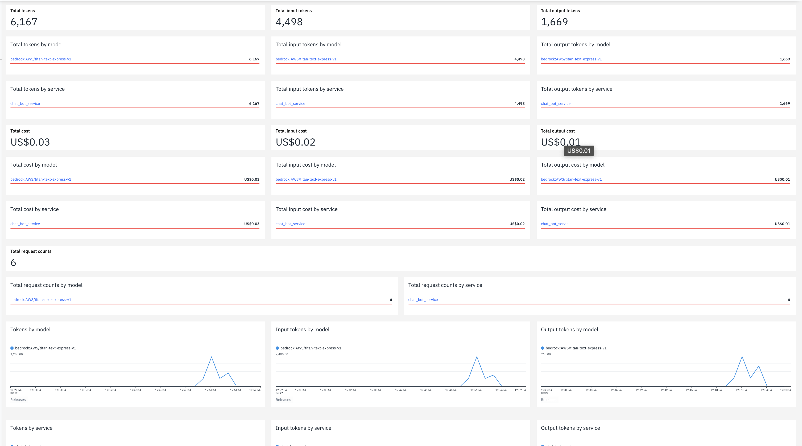

This guide explains how to set up and run your **Python app (`main.py`)** using **`uv`** for environment and dependency management.

## Prerequisites

Make sure the new system has:
- **Python 3.8+**
- **Internet access**
- **`uv`** installed

If `uv` is not installed, run one of the following commands:

```bash
curl -LsSf https://astral.sh/uv/install.sh | sh
```
or
```bash
pip install uv
```
## Steps for running the application

### 1. Sync Dependencies

Install all dependencies listed in `pyproject.toml` and `uv.lock`:

```bash
uv sync
```

### 2. Activate the Environment

You can manually activate the environment:

```bash
source .venv/bin/activate
```

### 3. Update the envs in `.env` file

Update **AWS Bedrock** creds such as 
- AWS_ACCESS_KEY_ID
- AWS_SECRET_ACCESS_KEY
- AWS_SESSION_TOKEN

Update Serper credential
- SERPER_API_KEY

Refer following documentation to know about **Traceloop environmental variables**:
https://www.ibm.com/docs/en/instana-observability/1.0.300?topic=started-traceloop-instrumentation#configuring-the-environment


### 4. For the collection of metrics, Install OTel Data Collector for GenAI (ODCG)

To install the data collector, Refer: https://www.ibm.com/docs/en/instana-observability/1.0.300?topic=started-install-otel-data-collector-genai-odcg

### 5. Run the App

Run the application using:

```bash
uv run main.py
```

## Output




## References

1. Traceloop configuration: https://www.ibm.com/docs/en/instana-observability/1.0.300?topic=started-traceloop-instrumentation#configuring-the-environment

